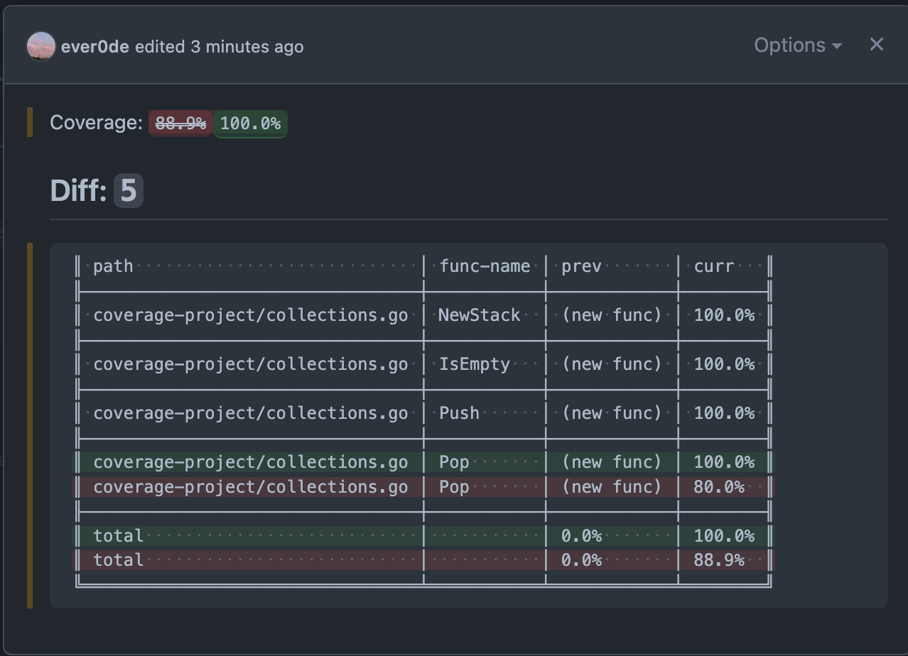

# coverage reporter for go (with github-action)

## Example comments

- If you only implemented the function

- If you implemented some test code for a function

- If you implemented your test code so that all lines are covered, the

